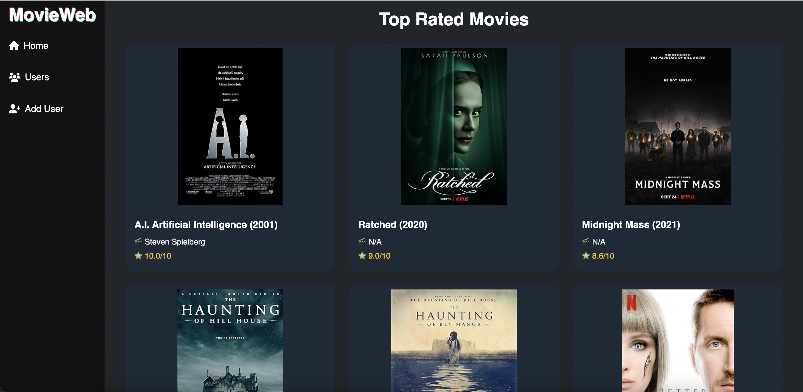
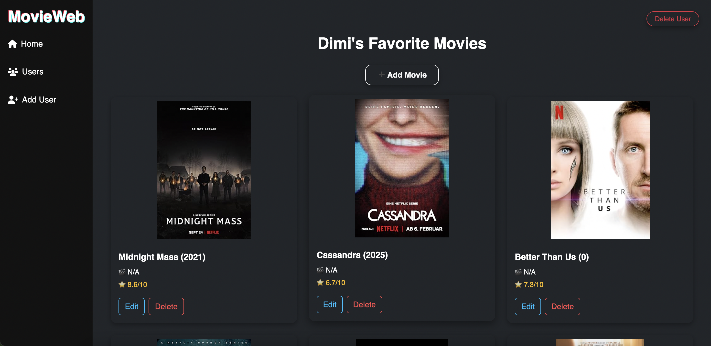
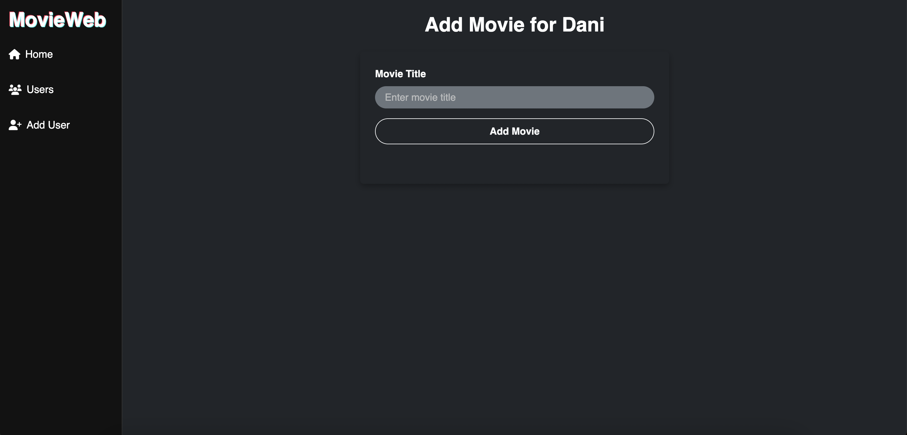

# 🎬 MovieWeb

MovieWeb is a web application that allows users to manage and explore their favorite movies. Built with Flask and styled using Bootstrap and custom CSS, it fetches movie data from the OMDb API and offers features like user-specific movie collections, editing, and top-rated movie browsing.

---

## 🚀 Features

* Add and manage users
* Add movies by title (auto-fetches details from OMDb)
* Edit and delete movies
* Top-rated movies shown on the homepage
* Fully responsive and modern UI using Bootstrap

---

## 💠 Tech Stack

* Python
* Flask️
* SQLite
* SQLAlchemy
* Bootstrap 5
* OMDb API

---

## 📦 Installation

1. **Clone the repository**

   ```bash
   git clone https://github.com/dimitar27/moviweb_app.git
   cd moviweb_app
   ```

2. **Create a virtual environment**

   ```bash
   python3 -m venv venv
   source venv/bin/activate  # or venv\Scripts\activate on Windows
   ```

3. **Install dependencies**

   ```bash
   pip install -r requirements.txt
   ```

4. **Set up environment**

   * Add your [OMDb API key](https://www.omdbapi.com/apikey.aspx) to `app.py`
   * Example:

     ```python
     OMDB_API_KEY = "your_api_key_here"
     ```

5. **Run the app**

   ```bash
   flask run
   ```

6. Visit [http://127.0.0.1:5000](http://127.0.0.1:5000)

---

## 📈 Screenshots

| Home Page (Top Rated)         | User's Movies                     | Add Movie                   |
| ----------------------------- | --------------------------------- | --------------------------- |
|  |  |  |

---

## 📁 Project Structure

```
moviweb_app/
│
├── templates/         # HTML templates
│   ├── base.html
│   ├── home.html
│   └── ...
│
├── static/            # CSS and JS files
│   └── style.css
│
├── datamanager/       # Data access layer
│   └── sqlite_data_manager.py
│
├── app.py             # Main Flask app
├── requirements.txt
└── README.md
```

---
